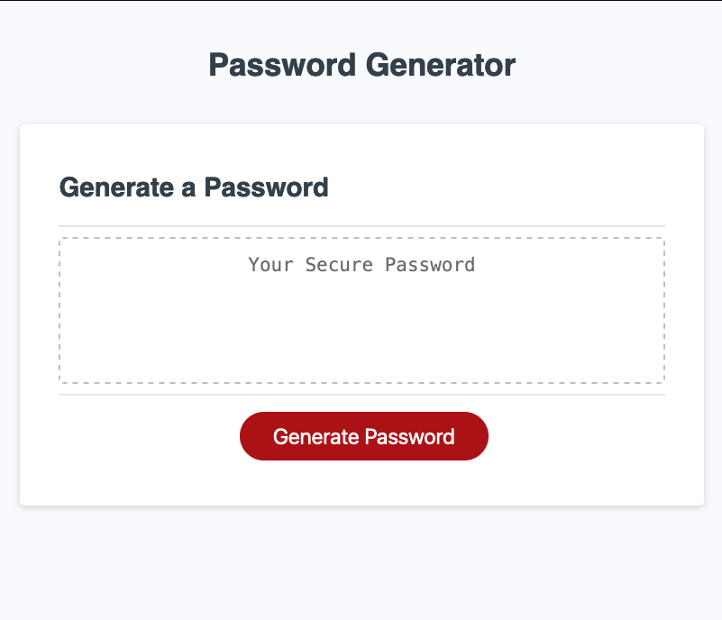

# Password Generator

## Description

**Front-End Web Development Bootcamp - Module 5 Challenge**

This password generator creates a pseudo-random password based on user choices, and displays it to the webpage.

## Installation

No need to install, simply visit:  **https://rgbrain.github.io/PW-Generator/**

## Usage

Having visited https://rgbrain.github.io/PW-Generator/, click on the 'Generate Password' button.  You will then be prompted to make a number of choices:

* Number of characters
* Include Special characters?
* Include Numberic characters?
* Include Lowercase characters?
* Include Uppercase characters?

NB. Number of characters must be between 10 and 64 (inclusive) and at least one character set must be chosen.

A pseudo-random password will then appear in the box on the page - see below screenshot.

**SCREENSHOT**

   

## Credits

University of Birmingham - Front-End Web-Dev Bootcamp

## License

MIT License

Copyright (c) [2022] [Richard Brain]

Permission is hereby granted, free of charge, to any person obtaining a copy
of this software and associated documentation files (the "Software"), to deal
in the Software without restriction, including without limitation the rights
to use, copy, modify, merge, publish, distribute, sublicense, and/or sell
copies of the Software, and to permit persons to whom the Software is
furnished to do so, subject to the following conditions:

The above copyright notice and this permission notice shall be included in all
copies or substantial portions of the Software.

THE SOFTWARE IS PROVIDED "AS IS", WITHOUT WARRANTY OF ANY KIND, EXPRESS OR
IMPLIED, INCLUDING BUT NOT LIMITED TO THE WARRANTIES OF MERCHANTABILITY,
FITNESS FOR A PARTICULAR PURPOSE AND NONINFRINGEMENT. IN NO EVENT SHALL THE
AUTHORS OR COPYRIGHT HOLDERS BE LIABLE FOR ANY CLAIM, DAMAGES OR OTHER
LIABILITY, WHETHER IN AN ACTION OF CONTRACT, TORT OR OTHERWISE, ARISING FROM,
OUT OF OR IN CONNECTION WITH THE SOFTWARE OR THE USE OR OTHER DEALINGS IN THE
SOFTWARE.

---

